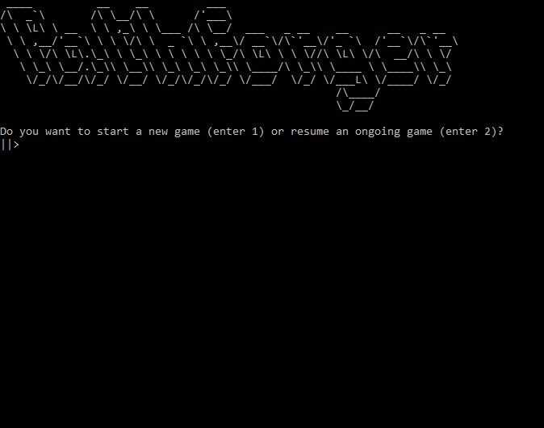

# Pathforger-


This is a text-based game based in the world of [Will Wight's Cradle series](https://www.amazon.com/dp/B0753FP6SP?searchxofy=true&ref_=dbs_s_aps_series_rwt).


## Before playing-
1. Download and install anaconda from [here](https://www.anaconda.com/products/individual)
2. Create conda environment using ```conda create --name pathforger python=3.8```
3. Activate the environment with ```conda activate pathforger```

## To start the game-
1. Navigate to game folder
2. Execute ```run.bat```